# Repo graph — spark-dashboard

Module/dependency graph, generated from `mod`/use declarations and import statements.
Regenerate on request (edge extraction script; re-run after structural changes).

Edge = "imports/uses". Dotted edge = the binary embeds and serves the built frontend.

```mermaid
graph TD
  subgraph rust["Rust backend (src/)"]
    subgraph r_core["core: server, ws, config, deploy, logs"]
      src_server_rs["server.rs"]
      src_ws_rs["ws.rs"]
      src_config_store_rs["config_store.rs"]
      src_deploy_files_rs["deploy_files.rs"]
      src_logs_rs["logs.rs"]
    end
    subgraph r_cli["cli: spark-dashboard CLI"]
      src_cli_mod_rs["cli/mod.rs"]
      src_cli_healthcheck_rs["cli/healthcheck.rs"]
      src_cli_service_rs["cli/service.rs"]
    end
    subgraph r_metrics["metrics: collectors"]
      src_metrics_mod_rs["metrics/mod.rs"]
      src_metrics_cpu_rs["metrics/cpu.rs"]
      src_metrics_disk_rs["metrics/disk.rs"]
      src_metrics_gpu_rs["metrics/gpu.rs"]
      src_metrics_gpu_sim_rs["metrics/gpu_sim.rs"]
      src_metrics_memory_rs["metrics/memory.rs"]
      src_metrics_network_rs["metrics/network.rs"]
    end
    subgraph r_engines["engines: inference backends"]
      src_engines_mod_rs["engines/mod.rs"]
      src_engines_detector_rs["engines/detector.rs"]
      src_engines_vllm_rs["engines/vllm.rs"]
      src_engines_histogram_rs["engines/histogram.rs"]
      src_engines_prometheus_rs["engines/prometheus.rs"]
      src_engines_warmup_rs["engines/warmup.rs"]
    end
    src_main_rs["main.rs"]
  end
  subgraph fe["Frontend (frontend/src/)"]
    subgraph f_entry["entry"]
      frontend_src_App_tsx["App.tsx"]
      frontend_src_main_tsx["main.tsx"]
    end
    subgraph f_hooks["hooks/"]
      frontend_src_hooks_useDashboardConfiguration_ts["hooks/useDashboardConfiguration.ts"]
      frontend_src_hooks_useElementSize_ts["hooks/useElementSize.ts"]
      frontend_src_hooks_useMetrics_ts["hooks/useMetrics.ts"]
      frontend_src_hooks_useMetricsHistory_ts["hooks/useMetricsHistory.ts"]
      frontend_src_hooks_useSloSettings_ts["hooks/useSloSettings.ts"]
      frontend_src_hooks_useTabRotation_ts["hooks/useTabRotation.ts"]
    end
    subgraph f_lib["lib/ (pure logic)"]
      frontend_src_lib_circular_buffer_ts["lib/circular-buffer.ts"]
      frontend_src_lib_engineAggregate_ts["lib/engineAggregate.ts"]
      frontend_src_lib_engineStats_ts["lib/engineStats.ts"]
      frontend_src_lib_format_ts["lib/format.ts"]
      frontend_src_lib_gpuPower_ts["lib/gpuPower.ts"]
      frontend_src_lib_identity_ts["lib/identity.ts"]
      frontend_src_lib_latencyMode_ts["lib/latencyMode.ts"]
      frontend_src_lib_providerLogo_ts["lib/providerLogo.ts"]
      frontend_src_lib_rotation_ts["lib/rotation.ts"]
      frontend_src_lib_slo_ts["lib/slo.ts"]
      frontend_src_lib_theme_ts["lib/theme.ts"]
      frontend_src_lib_utils_ts["lib/utils.ts"]
    end
    subgraph f_dash["lib/dashboard/"]
      frontend_src_lib_dashboard_bindings_ts["lib/dashboard/bindings.ts"]
      frontend_src_lib_dashboard_client_ts["lib/dashboard/client.ts"]
      frontend_src_lib_dashboard_grid_ts["lib/dashboard/grid.ts"]
      frontend_src_lib_dashboard_json_ts["lib/dashboard/json.ts"]
      frontend_src_lib_dashboard_load_ts["lib/dashboard/load.ts"]
      frontend_src_lib_dashboard_migrations_ts["lib/dashboard/migrations.ts"]
      frontend_src_lib_dashboard_notices_ts["lib/dashboard/notices.ts"]
      frontend_src_lib_dashboard_panels_ts["lib/dashboard/panels.ts"]
      frontend_src_lib_dashboard_preset_ts["lib/dashboard/preset.ts"]
      frontend_src_lib_dashboard_schema_ts["lib/dashboard/schema.ts"]
    end
    subgraph f_comp["components/ (views, charts, gauges, engines, ui)"]
      frontend_src_components_ConfigurationNotices_tsx["components/ConfigurationNotices.tsx"]
      frontend_src_components_ConnectionBadge_tsx["components/ConnectionBadge.tsx"]
      frontend_src_components_LogViewer_tsx["components/LogViewer.tsx"]
      frontend_src_components_MetricRow_tsx["components/MetricRow.tsx"]
      frontend_src_components_StackedBar_tsx["components/StackedBar.tsx"]
      frontend_src_components_charts_BigNumberSparkline_tsx["components/charts/BigNumberSparkline.tsx"]
      frontend_src_components_charts_CoreHeatmap_tsx["components/charts/CoreHeatmap.tsx"]
      frontend_src_components_charts_Sparkline_tsx["components/charts/Sparkline.tsx"]
      frontend_src_components_charts_TimeSeriesChart_tsx["components/charts/TimeSeriesChart.tsx"]
      frontend_src_components_engines_AnimatedCounter_tsx["components/engines/AnimatedCounter.tsx"]
      frontend_src_components_engines_EngineCard_tsx["components/engines/EngineCard.tsx"]
      frontend_src_components_engines_EngineCardPrimitives_tsx["components/engines/EngineCardPrimitives.tsx"]
      frontend_src_components_engines_EngineSection_tsx["components/engines/EngineSection.tsx"]
      frontend_src_components_engines_EngineTab_tsx["components/engines/EngineTab.tsx"]
      frontend_src_components_engines_GlobalEngineCard_tsx["components/engines/GlobalEngineCard.tsx"]
      frontend_src_components_engines_GlobalEngineTab_tsx["components/engines/GlobalEngineTab.tsx"]
      frontend_src_components_engines_LatencyModeControl_tsx["components/engines/LatencyModeControl.tsx"]
      frontend_src_components_engines_SloSettingsControl_tsx["components/engines/SloSettingsControl.tsx"]
      frontend_src_components_engines_TabRotationControl_tsx["components/engines/TabRotationControl.tsx"]
      frontend_src_components_gauges_ArcGauge_tsx["components/gauges/ArcGauge.tsx"]
      frontend_src_components_gauges_HBar_tsx["components/gauges/HBar.tsx"]
      frontend_src_components_ui_badge_tsx["components/ui/badge.tsx"]
      frontend_src_components_ui_button_tsx["components/ui/button.tsx"]
      frontend_src_components_ui_card_tsx["components/ui/card.tsx"]
      frontend_src_components_ui_chart_tsx["components/ui/chart.tsx"]
      frontend_src_components_ui_separator_tsx["components/ui/separator.tsx"]
      frontend_src_components_ui_tabs_tsx["components/ui/tabs.tsx"]
      frontend_src_components_ui_tooltip_tsx["components/ui/tooltip.tsx"]
      frontend_src_components_views_Dashboard_tsx["components/views/Dashboard.tsx"]
    end
    subgraph f_types["types/"]
      frontend_src_types_events_ts["types/events.ts"]
      frontend_src_types_metrics_ts["types/metrics.ts"]
    end
  end
  %% rust edges
  src_logs_rs --> src_engines_mod_rs
  src_main_rs --> src_cli_mod_rs
  src_main_rs --> src_config_store_rs
  src_main_rs --> src_deploy_files_rs
  src_main_rs --> src_engines_mod_rs
  src_main_rs --> src_metrics_mod_rs
  src_main_rs --> src_server_rs
  src_main_rs --> src_ws_rs
  src_main_rs --> src_logs_rs
  src_server_rs --> src_config_store_rs
  src_server_rs --> src_ws_rs
  src_server_rs --> src_logs_rs
  src_cli_healthcheck_rs --> src_server_rs
  src_cli_healthcheck_rs --> src_config_store_rs
  src_cli_healthcheck_rs --> src_cli_mod_rs
  src_cli_mod_rs --> src_cli_healthcheck_rs
  src_cli_mod_rs --> src_cli_service_rs
  src_cli_service_rs --> src_deploy_files_rs
  src_cli_service_rs --> src_cli_mod_rs
  src_engines_detector_rs --> src_engines_mod_rs
  src_engines_histogram_rs --> src_engines_mod_rs
  src_engines_mod_rs --> src_engines_detector_rs
  src_engines_mod_rs --> src_engines_histogram_rs
  src_engines_mod_rs --> src_engines_prometheus_rs
  src_engines_mod_rs --> src_engines_vllm_rs
  src_engines_mod_rs --> src_engines_warmup_rs
  src_engines_mod_rs --> src_engines_mod_rs
  src_engines_prometheus_rs --> src_engines_mod_rs
  src_engines_vllm_rs --> src_engines_mod_rs
  src_engines_warmup_rs --> src_engines_mod_rs
  src_metrics_cpu_rs --> src_metrics_mod_rs
  src_metrics_disk_rs --> src_metrics_mod_rs
  src_metrics_gpu_rs --> src_metrics_mod_rs
  src_metrics_gpu_sim_rs --> src_metrics_mod_rs
  src_metrics_memory_rs --> src_metrics_mod_rs
  src_metrics_mod_rs --> src_metrics_cpu_rs
  src_metrics_mod_rs --> src_metrics_disk_rs
  src_metrics_mod_rs --> src_metrics_gpu_rs
  src_metrics_mod_rs --> src_metrics_gpu_sim_rs
  src_metrics_mod_rs --> src_metrics_memory_rs
  src_metrics_mod_rs --> src_metrics_network_rs
  src_metrics_mod_rs --> src_engines_mod_rs
  src_metrics_network_rs --> src_metrics_mod_rs
  %% frontend edges
  frontend_src_App_tsx --> frontend_src_hooks_useDashboardConfiguration_ts
  frontend_src_App_tsx --> frontend_src_hooks_useMetrics_ts
  frontend_src_App_tsx --> frontend_src_hooks_useMetricsHistory_ts
  frontend_src_App_tsx --> frontend_src_components_ConfigurationNotices_tsx
  frontend_src_App_tsx --> frontend_src_components_ConnectionBadge_tsx
  frontend_src_App_tsx --> frontend_src_components_views_Dashboard_tsx
  frontend_src_App_tsx --> frontend_src_components_LogViewer_tsx
  frontend_src_App_tsx --> frontend_src_types_events_ts
  frontend_src_components_ConnectionBadge_tsx --> frontend_src_hooks_useMetrics_ts
  frontend_src_components_LogViewer_tsx --> frontend_src_lib_identity_ts
  frontend_src_components_LogViewer_tsx --> frontend_src_types_metrics_ts
  frontend_src_components_charts_BigNumberSparkline_tsx --> frontend_src_components_charts_Sparkline_tsx
  frontend_src_components_engines_EngineCard_tsx --> frontend_src_components_engines_EngineCardPrimitives_tsx
  frontend_src_components_engines_EngineCard_tsx --> frontend_src_components_engines_AnimatedCounter_tsx
  frontend_src_components_engines_EngineCard_tsx --> frontend_src_components_engines_SloSettingsControl_tsx
  frontend_src_components_engines_EngineCardPrimitives_tsx --> frontend_src_components_engines_AnimatedCounter_tsx
  frontend_src_components_engines_EngineSection_tsx --> frontend_src_components_engines_EngineTab_tsx
  frontend_src_components_engines_EngineSection_tsx --> frontend_src_components_engines_EngineCard_tsx
  frontend_src_components_engines_EngineSection_tsx --> frontend_src_components_engines_GlobalEngineTab_tsx
  frontend_src_components_engines_EngineSection_tsx --> frontend_src_components_engines_GlobalEngineCard_tsx
  frontend_src_components_engines_EngineSection_tsx --> frontend_src_components_engines_TabRotationControl_tsx
  frontend_src_components_engines_EngineSection_tsx --> frontend_src_components_engines_LatencyModeControl_tsx
  frontend_src_components_engines_GlobalEngineCard_tsx --> frontend_src_components_engines_EngineCardPrimitives_tsx
  frontend_src_components_engines_GlobalEngineCard_tsx --> frontend_src_components_engines_AnimatedCounter_tsx
  frontend_src_components_gauges_HBar_tsx --> frontend_src_components_gauges_ArcGauge_tsx
  frontend_src_hooks_useMetrics_ts --> frontend_src_types_metrics_ts
  frontend_src_hooks_useMetricsHistory_ts --> frontend_src_lib_circular_buffer_ts
  frontend_src_hooks_useMetricsHistory_ts --> frontend_src_lib_identity_ts
  frontend_src_hooks_useMetricsHistory_ts --> frontend_src_types_metrics_ts
  frontend_src_lib_dashboard_bindings_ts --> frontend_src_lib_dashboard_json_ts
  frontend_src_lib_dashboard_client_ts --> frontend_src_lib_dashboard_schema_ts
  frontend_src_lib_dashboard_grid_ts --> frontend_src_lib_dashboard_json_ts
  frontend_src_lib_dashboard_load_ts --> frontend_src_lib_dashboard_json_ts
  frontend_src_lib_dashboard_load_ts --> frontend_src_lib_dashboard_migrations_ts
  frontend_src_lib_dashboard_load_ts --> frontend_src_lib_dashboard_preset_ts
  frontend_src_lib_dashboard_load_ts --> frontend_src_lib_dashboard_schema_ts
  frontend_src_lib_dashboard_migrations_ts --> frontend_src_lib_dashboard_schema_ts
  frontend_src_lib_dashboard_migrations_ts --> frontend_src_lib_dashboard_json_ts
  frontend_src_lib_dashboard_notices_ts --> frontend_src_lib_dashboard_load_ts
  frontend_src_lib_dashboard_preset_ts --> frontend_src_lib_dashboard_bindings_ts
  frontend_src_lib_dashboard_preset_ts --> frontend_src_lib_dashboard_grid_ts
  frontend_src_lib_dashboard_preset_ts --> frontend_src_lib_dashboard_panels_ts
  frontend_src_lib_dashboard_preset_ts --> frontend_src_lib_dashboard_schema_ts
  frontend_src_lib_dashboard_schema_ts --> frontend_src_lib_dashboard_bindings_ts
  frontend_src_lib_dashboard_schema_ts --> frontend_src_lib_dashboard_grid_ts
  frontend_src_lib_dashboard_schema_ts --> frontend_src_lib_dashboard_json_ts
  frontend_src_lib_dashboard_schema_ts --> frontend_src_lib_dashboard_panels_ts
  frontend_src_lib_engineAggregate_ts --> frontend_src_lib_providerLogo_ts
  frontend_src_main_tsx --> frontend_src_App_tsx
  %% cross-stack: embedded assets (rust-embed serves built dist/)
  src_deploy_files_rs -.->|"serves frontend/dist (rust-embed)"| f_entry
```

## Notes
- `.test.ts(x)` specs and `frontend/src/test/` harness excluded (test-only edges).
- External deps (axum, tokio, recharts, etc.) omitted — internal structure only.
